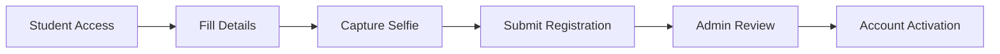

# 🎯 Face-Based Student Attendance System

<div align="center">
  
  
  
  
  
  
  

  **A cutting-edge Django web application leveraging advanced facial recognition technology for automated student attendance tracking**

  [🚀 Quick Start](#-installation--setup) • [📖 Documentation](#-usage-guide) • [🎨 Features](#-features) • [🤝 Contributing](#-contributing)

</div>

---

## 📋 Table of Contents

- [✨ Features](#-features)
- [🛠️ Technology Stack](#️-technology-stack)
- [📋 Prerequisites](#-prerequisites)
- [🚀 Installation & Setup](#-installation--setup)
- [📖 Usage Guide](#-usage-guide)
- [📁 Project Structure](#-project-structure)
- [🗄️ Database Models](#️-database-models)
- [🌐 API Endpoints](#-api-endpoints)
- [⚙️ Configuration](#️-configuration)
- [🔧 Troubleshooting](#-troubleshooting)
- [🔒 Security](#-security)
- [🤝 Contributing](#-contributing)
- [📄 License](#-license)

---

## ✨ Features

<table>
<tr>
<td width="50%">

### 🎭 **Core Functionality**
- 🧠 **AI-Powered Recognition** - FaceNet & MTCNN integration
- 📷 **Multi-Camera Support** - Simultaneous camera management
- ⚡ **Real-Time Processing** - Live face detection with audio feedback
- 🔐 **Secure Registration** - Web-based selfie capture system

</td>
<td width="50%">

### 📊 **Management & Analytics**
- 👥 **Student Management** - Comprehensive admin dashboard
- 📈 **Attendance Tracking** - Automated check-in/check-out
- 📋 **Export Capabilities** - Excel/CSV attendance reports
- 🎨 **Modern UI** - Dark-themed responsive interface

</td>
</tr>
</table>

---

## 🛠️ Technology Stack

<div align="center">

### **Backend**


### **Computer Vision & AI**


### **Frontend & UI**


### **Database & Audio**


</div>

---

## 📋 Prerequisites

> **⚠️ System Requirements**

| Component | Requirement |
|-----------|-------------|
| 🐍 **Python** | Version 3.8 or higher |
| 📷 **Camera** | Webcam or IP camera access |
| 🔧 **Git** | For repository cloning |
| 💾 **Storage** | Minimum 500MB free space |
| 🖥️ **OS** | Windows, macOS, or Linux |

---

## 🚀 Installation & Setup

### **Step 1: Clone Repository**
```bash
# 📥 Clone the project
git clone <your-repository-url>
cd Face-Recognition-Attendance-system
```

### **Step 2: Virtual Environment Setup**
```bash
# 🐍 Create virtual environment
python -m venv venv

# 🔄 Activate environment
# Windows:
venv\Scripts\activate
# macOS/Linux:
source venv/bin/activate
```

### **Step 3: Install Dependencies**
```bash
# 📦 Install required packages
pip install -r requirements.txt
```

### **Step 4: Database Configuration**
```bash
# 🗄️ Setup database
python manage.py makemigrations
python manage.py migrate

# 👤 Create admin account
python manage.py createsuperuser
```

### **Step 5: Media Directory Setup**
```bash
# 📁 Create media folders
mkdir media
mkdir media/students
```

### **Step 6: Launch Application**
```bash
# 🚀 Start development server
python manage.py runserver
```

<div align="center">
  
  🎉 **Success!** Navigate to `http://127.0.0.1:8000/`
  
</div>

---

## 📖 Usage Guide

### 🔐 **Initial Setup**

<details>
<summary><b>👤 Admin Configuration</b></summary>

1. **Login**: Visit `http://127.0.0.1:8000/login/`
2. **Camera Setup**: Configure camera sources and recognition thresholds
3. **System Settings**: Adjust parameters for optimal performance

</details>

### 🎓 **Student Registration Process**

<details>
<summary><b>📝 Self-Registration Flow</b></summary>



1. **Student Portal**: `http://127.0.0.1:8000/capture_student/`
2. **Data Entry**: Complete personal information
3. **Photo Capture**: Take selfie using webcam
4. **Submission**: Register for admin review
5. **Activation**: Admin authorizes account

</details>

### 📊 **Attendance Tracking**

<details>
<summary><b>⚡ Real-Time Recognition</b></summary>

| Action | Description |
|--------|-------------|
| 🎬 **Start Recognition** | Launch camera windows for all configured cameras |
| 🎯 **Auto Detection** | System recognizes faces and logs attendance |
| 🔊 **Audio Feedback** | Success notifications for recognized students |
| ⏹️ **Stop Process** | Press 'q' in any camera window to exit |

</details>

### 📈 **Data Export & Reports**

<div align="center">

**📋 Attendance Management**

| Format | Description | Use Case |
|--------|-------------|----------|
| 📊 **Excel** | Formatted spreadsheet | Detailed analysis |
| 📄 **CSV** | Raw data export | System integration |

</div>

---

## 📁 Project Structure

```
📦 Face-Attendance-System/
├── 🏗️ Project101/                 # Django Configuration
│   ├── ⚙️ settings.py            # Main settings
│   ├── 🌐 urls.py               # URL routing
│   └── 🚀 wsgi.py               # WSGI config
├── 📱 app1/                      # Core Application
│   ├── 🗄️ models.py             # Database models
│   ├── 👁️ views.py              # Business logic
│   ├── 🔗 urls.py               # App URLs
│   ├── 🎛️ admin.py              # Admin interface
│   └── 🔊 suc.wav               # Success sound
├── 🎨 templates/                 # HTML Templates
│   ├── 🏠 home.html             # Dashboard
│   ├── 🔐 login.html            # Authentication
│   ├── 📷 capture_student.html  # Registration
│   └── 📊 student_list.html     # Management
├── 📁 media/                     # User Uploads
│   └── 👥 students/             # Profile photos
├── 🎯 static/                    # Static Assets
├── 🔧 manage.py                 # Django CLI
├── 📋 requirements.txt          # Dependencies
└── 📖 README.md                # Documentation
```

---

## 🗄️ Database Models

<div align="center">

### **📊 Data Architecture**

</div>

| Model | Fields | Purpose |
|-------|---------|---------|
| 👤 **Student** | Name, Email, Phone, Class, Image, Status | User management |
| 📅 **Attendance** | Student, Date, Check-in, Check-out, Duration | Time tracking |
| 📷 **CameraConfig** | Name, Source, Threshold | Camera settings |

---

## 🌐 API Endpoints

<table>
<tr>
<th>🌍 Route</th>
<th>📝 Description</th>
<th>🎯 Purpose</th>
</tr>
<tr>
<td><code>/</code></td>
<td>Main Dashboard</td>
<td>System overview</td>
</tr>
<tr>
<td><code>/capture_student/</code></td>
<td>Student Registration</td>
<td>New student signup</td>
</tr>
<tr>
<td><code>/capture-and-recognize/</code></td>
<td>Face Recognition</td>
<td>Attendance tracking</td>
</tr>
<tr>
<td><code>/students/</code></td>
<td>Student Management</td>
<td>Admin panel</td>
</tr>
<tr>
<td><code>/students/attendance/</code></td>
<td>Attendance Records</td>
<td>View/export data</td>
</tr>
<tr>
<td><code>/camera-config/</code></td>
<td>Camera Configuration</td>
<td>System settings</td>
</tr>
<tr>
<td><code>/login/</code></td>
<td>Admin Authentication</td>
<td>Secure access</td>
</tr>
</table>

---

## ⚙️ Configuration

### 📷 **Camera Settings**

<div align="center">

| Type | Configuration | Example |
|------|---------------|---------|
| 🖥️ **Local Webcam** | Camera index | `0`, `1`, `2` |
| 🌐 **IP Camera** | Full URL | `http://192.168.1.100:8080/video` |
| 🎯 **Threshold** | Recognition confidence | `0.6` (recommended) |

</div>

### 🔊 **Audio Configuration**
- **Sound File**: Place at `app1/suc.wav`
- **Formats**: WAV, MP3, OGG supported
- **Purpose**: Success notification feedback

---

## 🔧 Troubleshooting

<details>
<summary><b>📷 Camera Issues</b></summary>

**Problem**: Camera not working
- ✅ Check camera permissions
- ✅ Verify camera index/URL
- ✅ Close other camera applications
- ✅ Test with different camera sources

</details>

<details>
<summary><b>🎯 Recognition Accuracy</b></summary>

**Problem**: Poor face recognition
- ✅ Adjust threshold in camera config
- ✅ Ensure adequate lighting
- ✅ Use high-quality student photos
- ✅ Position camera at eye level

</details>

<details>
<summary><b>📦 Dependencies Issues</b></summary>

**Problem**: Installation failures
```bash
# Upgrade pip
pip install --upgrade pip

# Install individually if needed
pip install django opencv-python torch torchvision
```

</details>

<details>
<summary><b>🗄️ Database Problems</b></summary>

**Problem**: Database errors
```bash
# Reset database
rm db.sqlite3
python manage.py makemigrations
python manage.py migrate
python manage.py createsuperuser
```

</details>

---

## 🔒 Security

<div align="center">

### **🛡️ Security Best Practices**

</div>

| Area | Recommendation | Implementation |
|------|----------------|----------------|
| 🔐 **Authentication** | Strong passwords | Django auth system |
| 🌐 **Production** | HTTPS encryption | SSL certificates |
| 🔑 **Secret Keys** | Environment variables | `.env` configuration |
| 💾 **Data Backup** | Regular backups | Automated scheduling |
| 📱 **Access Control** | Role-based permissions | Admin authorization |

---

## 🤝 Contributing

<div align="center">

**We welcome contributions!** 🎉

</div>

### **🔄 Contribution Process**

1. **🍴 Fork** the repository
2. **🌿 Branch** for your feature (`git checkout -b feature/amazing-feature`)
3. **💻 Code** your improvements
4. **🧪 Test** thoroughly
5. **📝 Commit** your changes (`git commit -m 'Add amazing feature'`)
6. **🚀 Push** to branch (`git push origin feature/amazing-feature`)
7. **🔀 Pull Request** for review

### **📋 Contribution Guidelines**

- Follow PEP 8 coding standards
- Write descriptive commit messages
- Include tests for new features
- Update documentation as needed
- Ensure backward compatibility

---

## 📄 License

<div align="center">

**📖 Open Source Project**

This project is released under an open source license.
Check the `LICENSE` file for detailed terms and conditions.

</div>

---

## 🏆 Acknowledgments

<div align="center">

**🙏 Built with incredible tools and libraries**

[](https://github.com/timesler/facenet-pytorch)
[](https://djangoproject.com/)
[](https://opencv.org/)
[](https://getbootstrap.com/)

</div>

---

## 📞 Support & Contact

<div align="center">

**💡 Need Help?**

| Resource | Description |
|----------|-------------|
| 📚 **Documentation** | Check troubleshooting section |
| 🐛 **Bug Reports** | Create GitHub issue |
| 💬 **Questions** | Discussion forum |
| 🔧 **Technical Support** | Email support team |

**⭐ If this project helped you, please give it a star!**

---

<sub>Made with ❤️ by the Face Attendance System Team</sub>

</div>